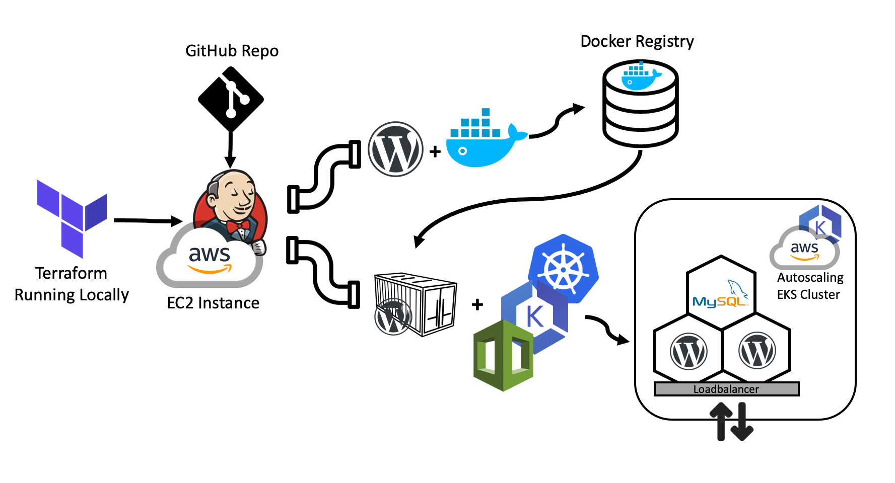

# Wordpress + Jenkins + Kubernetes + Terraform
The repository contains a Jenkins server that generates a Wordpress container an pushes it to Docker Registry. There is another pipeline where an Amazon EKS cluster is provisioned with 4 nodes. Than the Wordpress and MySQL containers are deployed using a kubernetes kustomization file. The last step is where the autoscaling is enabled, deploying one extra pod for redundancy and deploying extras when the CPU reaches an 80% threshold. The data is stored in a persistent volume and the Wordpress deployment is LoadBalancer

### Overall solution

### Automatic Jenkins provisioning at AWS
The first step is to provision the Jenkins machine, which is an Amazon EC2, based on a preexisting image of Jenkins provided by bitnami. To provision the machine, there is a terraform plan [init_jenkins.tf].

Step 2 is manual and involves create the pipelines and connect to the git repository to recover the JenkinsFiles with the execution steps to the workspace.

### Wordpress Docker image creation
This step is intended to simulate and represent the software preparation and its consolidation in a container that may be uploaded to a public or a private container registry. In this case, we create a container based on a preexisting image (wordpress:php7.1-apache) and move some files to there. The resulting image is uploaded to the docker hub registry.

### Kubernetes Cluster provisioning with Amazon EKS
The provisioning prepares the Jenkins workspace installing the awscli and eksctl applications as well as configures the access key, secret and preferred region. At this point, they are plain text but could be stored at an identity inside Jenkins.

After the environment preparation, the EKS creates a cluster called wp, with 4 nodes, where the minimum is 4 and the maximum is 8, at the preferred region us-east-2. Under the hood, the eksclt creates a cloudformation stack that prepares a kubernetes cluster using the Elastic Kubernetes Service from AWS, that handles public and private networks, availability zones, base ami, group policies and endpoints with NAT and port-forwarding.

The service is deployed using the kustomization feature from kubectl, which allows to deploy multiple resources at the time and also handles the passwords with a secret generator. The final step is to enable the autoscaling through the kubectl command line.

The outcome is a kubernetes cluster with 2 load-balanced Wordpress pods and one MySQL pod with persistent volumes. All the cluster can be redeployed with one click and a new version of the Wordpress container can be enabled, also with one click.

### Possible Improvements
There are many possible improvements available for this infrastructure.
- The containers do not have health checks, which can be used to automatically redeploy problematic ones.
- The system does not have a monitoring system in place, the data may be helpful for problem troubleshooting and support scaling decisions.
- Jenkins could be integrated with the CI, the pipeline can be automatically started on commit, running tests before building the container.
- It could be used as a production testing service, chaos monkey. Responsible for turning containers down and causing problems to the environment. Checking the reliability of the redundancy mechanisms.
- Improved network isolation, an AWS VPC (Virtual Private Cloud), improving firewall, port-forwarding, and IP access control.
- It could be added redundancy to the MySQL pod.
- It could be configured Availability zones to Wordpress and MySQL. Allowing data synchronization from multiple geographic locations, failover, latency based routing. All this can be achieved with AWS Route 53.
- Another AWS service that can improve performance is AWS CloudFront as a CDN for static files.
- The system is already on an auto-scaling set, that can be scaled horizontally. Even though the ekscli/cloudformation could be replaced by the terraform eks module, which may provide more control over the scaling process, at least, it will be easier to maintain in an Infrastructure as Code style.
